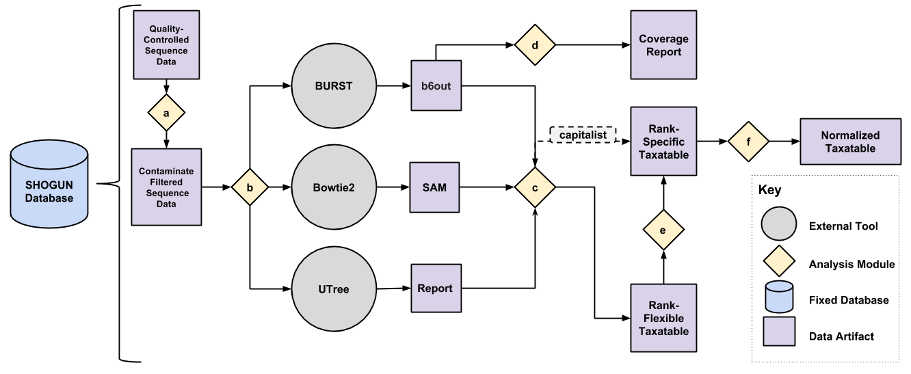

[](https://zenodo.org/badge/latestdoi/51028464)

Shallow shotgun sequencing
=======
Shallow seq pipeline for optimal shotgun data usage




Schematic overview of the shallow-shotgun computational pipeline SHOGUN. For every step in the SHOGUN pipeline, the user must supply the pre-formatted SHOGUN database folder. To run every step shown here in a single command, the user can select the pipeline subcommand. Otherwise, the analysis modules can be run independently.

a. *filter* - The input quality-controlled reads are aligned against the contaminate database using BURST to filter out all reads that hit human associated genome content.

b. *align* - The input contaminate filtered reads are aligned against the reference database. The user has the option to select one or all of the three alignment tools BURST, Bowtie2, or UTree.

c. *assign_taxonomy* - Given the data artifacts from a SHOGUN alignment tool, output a Biological Observation Matrix  format taxatable with the rows being rank-flexible taxonomies, the columns are samples, and the entries are counts for each given taxonomy per sample. The alignment tool BURST has two run modes, taxonomy and capitalist. If the capitalist mode is enabled, a rank-specific BIOM file is output instead.

d. *coverage* - The output from BURST can be utilized to analyze the coverage of each taxonomy across all samples in your alignment file. This can useful for reducing the number of false positive taxonomies.

e. *redistribute* - The rank-flexible taxatable is summarized into a rank-specific taxatable. This summarizes both up and down the taxonomic tree.

f. *normalize* - Each sample in the taxatable is normalized to the median depth of all the samples.

## Installation
These installation instructions are streamlined for Linux systems at this time. The tool SHOGUN is installable on Windows and macOS manually via the development installation. This package requires anaconda, which is a system agnostic package and virtual environment manager. Follow the installation instructions for your system at <http://conda.pydata.org/miniconda.html>.

### The CONDA way (personal install)
1. Follow steps 1 and 2 of <https://bioconda.github.io/> (including installing MiniConda 3.6 if you don't have miniconda)
2. Do this in a terminal:
```
conda create -n shogun -c knights-lab shogun
source activate shogun
```

### Development Installation


1. Do this in a terminal:
```
conda create -n shogun -c knights-lab shogun
source activate shogun
```

2. Remove SHOGUN and install via the github master branch. This will keep all the conda dependencies installed.
```
conda uninstall shogun
pip install git+https://github.com/knights-lab/SHOGUN.git --no-cache-dir --upgrade
```

Optional: You can reinstall to the newest git version of SHOGUN at anytime via the command:
```
pip install git+https://github.com/knights-lab/SHOGUN.git --no-cache-dir --upgrade
```

### Testing your installation

For testing, we are currently using the built in python unittests. In order to run the test suite, change directory into the root folder of the repository. Then run:

```
python -m unittest discover shogun
```

# Documentation

#### SHOGUN help for Command-Line
SHOGUN is a command line application. It is meant to be run with a single command. The helpful for the command is below.

```
Usage: shogun [OPTIONS] COMMAND [ARGS]...

  SHOGUN command-line interface

  --------------------------------------

Options:
  --log [debug|info|warning|critical]
                                  The log level to record.
  --shell / --no-shell            Use the shell for Python subcommands (not
                                  recommended).
  --version                       Show the version and exit.
  -h, --help                      Show this message and exit.

Commands:
  align                 Run a SHOGUN alignment algorithm.
  assign_taxonomy       Run the SHOGUN taxonomic profile algorithm on an...
  convert               Normalize a taxonomic profile using relative...
  coverage              Show confidence of coverage of microbes, must a be...
  filter                Filter out contaminate reads.
  functional            Run the SHOGUN functional algorithm on a taxonomic...
  normalize             Normalize a taxonomic profile by median depth.
  pipeline              Run the SHOGUN pipeline, including taxonomic and...
  redistribute          Run the SHOGUN redistribution algorithm on a...
  summarize_functional  Run the SHOGUN functional algorithm on a taxonomic...
```

#### align
  The command ```align``` runs the respective taxonomic aligner on a linearized, demultiplexed FASTA using either burst, bowtie2, or utree.

```
Usage: shogun align [OPTIONS]

  Run a SHOGUN alignment algorithm.

Options:
  -a, --aligner [all|bowtie2|burst|utree]
                                  The aligner to use.  [default: burst]
  -i, --input PATH                The file containing the combined seqs.
                                  [required]
  -d, --database PATH             The path to the database folder.
  -o, --output PATH               The output folder directory  [default: /mnt/
                                  c/Users/bhill/code/SHOGUN/results-170828]
  -t, --threads INTEGER           Number of threads to use.
  -h, --help                      Show this message and exit.
```

#### assign_taxonomy

```
Usage: shogun assign_taxonomy [OPTIONS]

  Run the SHOGUN taxonomic profile algorithm on an alignment output.

Options:
  -a, --aligner [bowtie2|burst|burst-tax|utree]
                                  The aligner to use.  [default: burst]
  -i, --input PATH                The output alignment file.
                                  [required]
  -d, --database PATH             The path to the database folder.
  -o, --output PATH               The coverage table.  [default: /mnt/c/Users/
                                  bhill/code/SHOGUN/taxatable-170828.txt]
  -h, --help                      Show this message and exit.
```


#### coverage

```
Usage: shogun coverage [OPTIONS]

  Show confidence of coverage of microbes.

Options:
  -i, --input PATH                The output BURST alignment.
                                  [required]
  -d, --database PATH             The path to the folder containing the
                                   database.  [required]
  -o, --output PATH               The coverage table.  [default: /mnt/c/Users/
                                  bhill/code/SHOGUN/coverage-170828.txt]
  -l, --level [genus|species|strain]
                                  The level to collapse to.
  -h, --help                      Show this message and exit.
```

#### functional

This command assigns function at a certain taxonomic level. Lower level KEGG IDs are assigned to higher level KEGG IDs through plurality voting. Note that plasmids are not included the KEGG ID annotation.

```
Usage: shogun functional [OPTIONS]

  Run the SHOGUN functional algorithm on a taxonomic profile.

Options:
  -i, --input PATH                The taxatable.  [required]
  -d, --database PATH             The path to the folder containing the
                                  function database.  [required]
  -o, --output PATH               The output file  [default: /mnt/c/Users/bhil
                                  l/code/SHOGUN/results-170828]
  -l, --level [genus|species|strain]
                                  The level to collapse to.
  -h, --help                      Show this message and exit.
```

#### normalize

```
Usage: shogun normalize [OPTIONS]

  Normalize a taxonomic profile by median depth.

Options:
  -i, --input PATH   The output taxatable.  [required]
  -o, --output PATH  The taxatable output normalized by median depth.
                     [default: /mnt/c/Users/bhill/code/SHOGUN/taxatable.normal
                     ized-170828.txt]
  -h, --help         Show this message and exit.
```

#### pipeline

```
Usage: shogun pipeline [OPTIONS]

  Run the SHOGUN pipeline, including taxonomic and functional profiling.

Options:
  -a, --aligner [all|bowtie2|burst|utree]
                                  The aligner to use [Note: default burst is
                                  capitalist, use burst-tax if you want to
                                  redistribute].  [default: burst]
  -i, --input PATH                The file containing the combined seqs.
                                  [required]
  -d, --database PATH             The path to the database folder.
  -o, --output PATH               The output folder directory  [default: /mnt/
                                  c/Users/bhill/code/SHOGUN/results-170828]
  -l, --level [kingdom|phylum|class|order|family|genus|species|strain|all|off]
                                  The level to collapse taxatables and
                                  functions to (not required, can specify
                                  off).
  --function / --no-function      Run functional algorithms. **This will
                                  normalize the taxatable by median depth.
  --capitalist / --no-capitalist  Run capitalist with burst post-align or not.
  -t, --threads INTEGER           Number of threads to use.
  -h, --help                      Show this message and exit.
```


#### redistribute
  This command redistributes the reads at a certain taxonomic level. This assumes that you have a BIOM txt file output from SHOGUN align, or even a summarized table from redistribute at a lower level.

```
Usage: shogun redistribute [OPTIONS]

  Run the SHOGUN redistribution algorithm on a taxonomic profile.

Options:
  -i, --input PATH                The taxatable.  [required]
  -d, --database PATH             The path to the database folder.  [required]
  -l, --level [kingdom|phylum|class|order|family|genus|species|strain|all]
                                  The level to collapse to.
  -o, --output PATH               The output file  [default: /mnt/c/Users/bhil
                                  l/code/SHOGUN/taxatable-170828.txt]
  -h, --help                      Show this message and exit.
```

#### summarize_functional
This command will take in a kegg table and output a summarized KEGG pathway and module table.

```
Usage: shogun summarize_functional [OPTIONS]

  Run the SHOGUN functional algorithm on a taxonomic profile.

Options:
  -i, --input PATH     The taxatable.  [required]
  -d, --database PATH  The path to the folder containing the database.
                       [required]
  -o, --output PATH    The output file  [default:
                       /home/grad00/hillm096/results-171106]
  -h, --help           Show this message and exit.
```


## Database creation.
To create a BURST database for SHOGUN, follow instructions on the BURST github page to create an acx and edx file with the same base filename, then create a file called "metadata.yaml" in the same folder, with an entry `burst: <basename>`, as in this example:
[https://github.com/knights-lab/SHOGUN/blob/master/shogun/tests/data/metadata.yaml](https://github.com/knights-lab/SHOGUN/blob/master/shogun/tests/data/metadata.yaml)

You will need a taxonomy file formatted as in the `genomes.small.tax` file [here](https://github.com/knights-lab/SHOGUN/tree/master/shogun/tests/data) to provide taxonomy. Add an entry to the yaml file with a key `general:` and a sub-key `taxonomy: <taxonomy file name>`. A bowtie2 database base filename and Utree database filename may be added as follows:
```
general:
  taxonomy: genomes.small.tax
  fasta: genomes.small.fna
  shear: sheared_bayes.fixed.txt
function: function/ko
burst: burst/genomes.small
bowtie2: bowtie2/genomes.small
utree: utree/genomes.small
```

A functional database is optional. Examples are shown [here](https://github.com/knights-lab/SHOGUN/tree/master/shogun/tests/data/function).

All database files for BURST, Bowtie2, and Utree should be in the same parent folder. Once the folder is created and the `metadata.yaml` file is populated as in the above example, the new database may be used in SHOGUN as follows:

```
shogun pipeline -i input.fna -d /path/to/database/parent/folder/ -o output -m burst
shogun pipeline -i input.fna -d /path/to/database/parent/folder/ -o output -m utree
shogun pipeline -i input.fna -d /path/to/database/parent/folder/ -o output -m bowtie2
```

For a prebuilt database, download the file locations [here](https://github.com/knights-lab/SHOGUN/tree/master/docs/shogun_db_links.txt) and run the command:

```
wget -i <path_to_folder>/shogun_db_links.txt
```
